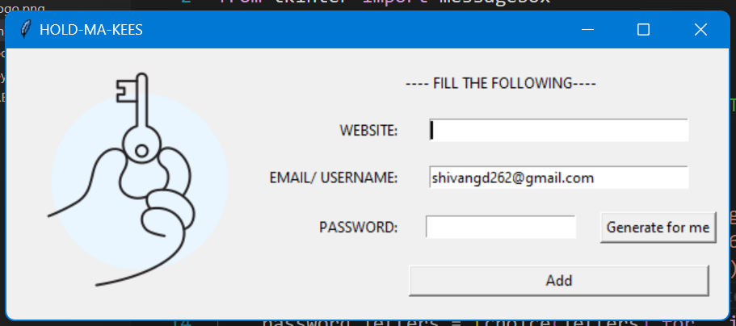

# HOLD-MA-KEES Password Manager

HOLD-MA-KEES is a simple password manager application built using Python and Tkinter. It allows users to generate secure passwords and store them alongside website and email/username information.

## Screenshots



## Features

- Generate secure random passwords
- Copy generated passwords to clipboard
- Save website, email/username, and password information to a file
- Search for previosly saved passwords using search button 
- User-friendly interface

## Requirements

- Python 3.x
- Tkinter (usually included with Python)
- pyperclip module

## Installation

1. **Clone the repository**:
    ```sh
    git clone https://github.com/SHIV-360/password_manager.git
    cd password_manager
    ```

2. **Install the required Python module**:
    ```sh
    pip install pyperclip
    ```

3. **Ensure you have Tkinter installed**:
    Tkinter is usually included with Python, but if it's not, you can install it using the appropriate package manager for your operating system.

## Usage

1. **Run the application**:
    ```sh
    python main.py
    ```

2. **Use the application**:
    - Enter the website and email/username.
    - Click "Generate for me" to generate a secure password.
    - Click "Add" to save the information to a file.
    - Type website name and Click "Search" to look for it's credentials.

## File Structure

- `main.py`: The main script that runs the application.
- `data.txt`: The file where website, email/username, and password information is saved.
- `logo.png`: The logo image displayed in the application.


